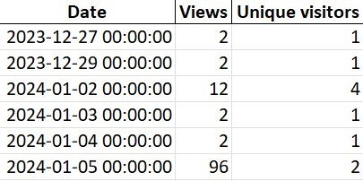

# GitHub Repository Traffic Data Fetcher

This tool is designed to fetch and process traffic data for GitHub repositories. It uses the GitHub API to retrieve information about repository views, clones, referrers, and popular content. The data is initially stored in MongoDB, then aggregated, and subsequently saved in a structured spreadsheet format for analysis and reporting.


*Example of an Excel sheet generated by the GitHub Repository Traffic Data Fetcher. This sheet illustrates traffic statistics including views, unique visitors, clones, and referring sites. It provides a comprehensive view of the repository's engagement over time.*

## Table of Contents

1. [Motivation Behind the Creation](Motivation-Behind-the-Creation)
1. [Features](Features)
1. [Prerequisites](Prerequisites)
1. [Configuration](Configuration)
1. [Usage](Usage)
1. [Data Output](Data-Output)
1. [Todo](Todo)
1. [Contributing](Contributing)
1. [License](License)

## Motivation Behind the Creation

The primary motivation for creating this script was to overcome a significant limitation of GitHub's native traffic data functionality, which only provides insights for the past 14 days. This restricted timeframe can be limiting for long-term analysis and understanding of the repository's traffic trends.

To address this issue, I developed this script to fetch and store GitHub traffic data in a database, enabling the tracking of historical data over extended periods. By archiving this data, users can perform more comprehensive analyses, identify trends, and make informed decisions based on a much richer dataset that spans beyond the 14-day window offered by GitHub.

This approach allows for a deeper understanding of how a repository is used and engaged with over time, providing valuable insights into the effectiveness of outreach efforts, the impact of new releases, and general user interest. The script's ability to store data in MongoDB ensures that this valuable information is not lost and can be accessed and analyzed whenever needed, offering a robust solution for long-term traffic data tracking and analysis.

## Features

- **Data Retrieval**: Fetches traffic, clones, referrers, and popular content data from GitHub repositories.
- **Timestamping**: Each record for referring sites and popular content includes a timestamp indicating the fetch time.
- **Data Aggregation**: Provides month-to-month and year-to-year aggregated data for easy analysis.
- **Excel Output**: Processed data can be saved to an Excel file with separate sheets for each data category.
- **MongoDB Integration**: Option to store the fetched data in a MongoDB database for persistent storage and retrieval.
- **Azure Blob Storage**: Option to store the Excel report in Azure Blob Storage, with the ability to generate a 24 hour temporary URL for secure file sharing.
- **Command Line Interface**: Easy to use CLI for specifying repository details and optional parameters.

## Prerequisites

- Python 3.x
- GitHub Personal Access Token (with appropriate permissions)
- MongoDB Database Server

> **Note:** You can sign up for Azure Cosmos DB for MongoDB for free and start building scalable applications. To get started, visit <https://aka.ms/trycosmosdb> to create a free account and explore the powerful features of Azure Cosmos DB.
>
### Setup

1. Clone the repository or download the script.
1. Install the required Python libraries using the `requirements.txt` file provided in the repository:

```bash
 pip install -r requirements.txt
```

### **GitHub Codespaces (Optional)**

You can try out this implementation by running the code in [GitHub Codespaces](https://docs.github.com/codespaces/overview) instead of a local clone.

- Open the application code in a GitHub Codespace:

    [](https://codespaces.new/jaydestro/GitHubRepoStats?quickstart=1&devcontainer_path=.devcontainer%2Fdevcontainer.json)

## Configuration

The script accepts the following command-line arguments:

- `--repo`: The name of the GitHub repository.
- `--owner`: The GitHub username or organization name that owns the repository.
- `--filename` (optional): Specify the filename for the Excel report. If not provided, it defaults to `{owner}-{repo}-traffic-data.xlsx`.
- `--token-file`: The path to the text file containing your GitHub Personal Access Token.
- `--mongodb-connection-string` (optional): The MongoDB connection string to store the data. Omit this flag if you do not wish to use MongoDB.
- `--azure-storage-connection-string` (optional): The Azure Blob Storage connection string for storing the Excel file. Omit this flag if you do not want to use Azure Blob Storage.

## Usage

1. Ensure you have a GitHub Personal Access Token with appropriate permissions. [Learn how to create one here.](https://docs.github.com/en/authentication/keeping-your-account-and-data-secure/creating-a-personal-access-token)
1. Store your Personal Access Token in a text file for security.
1. Run the script using the command:

   ```bash
   python script_name.py --repo <repository_name> --owner <owner_name> --token-file <path_to_token_file> [--filename <optional_filename.xlsx>] [--mongodb-connection-string <your_mongodb_connection_string>] --azure-storage-connection-string <your_azure_blob_storage_connection_string>
   ```

Replace `<repository_name>`, `<owner_name>`, `<optional_filename.xlsx>`, and `<path_to_token_file>`, `<your_mongodb_connection_string>`, `your_azure_blob_storage_connection_string` with your repository's name, repository owner's name, an optional filename for the Excel report, your MongoDB database connection string, and the path to your token file, and your optional storage connection string, respectively.

Example command:

   ```bash
   python report.py --repo your-repository --owner your-username --token-file path/to/token.txt
   ```

## Data Output

The script processes and outputs data in the following categories:

1. **Traffic Stats**:
   - Shows views and unique visitors statistics of the repository.
   - Data includes total views, unique visitors, and timestamps for each record.
   - Aggregated monthly and yearly totals are also provided for comprehensive analysis.

2. **Git Clones**:
   - Provides clone counts and unique cloners of the repository.
   - Each record includes the total number of clones and unique cloners, along with the corresponding date.
   - Like traffic stats, this category also includes month-to-month and year-to-year aggregated data.

3. **Referring Sites**:
   - Lists top referring sites with their views and unique visitors.
   - Each entry is timestamped to indicate the exact time of data retrieval.
   - The data is aggregated monthly and yearly to observe trends and changes over time.

4. **Popular Content**:
   - Highlights the most visited paths in the repository.
   - Records include path details, view counts, unique visitors, and a timestamp.
   - Aggregated data on a monthly and yearly basis is provided for in-depth analysis.

Each category is available in a structured format and is saved into separate sheets in an Excel file. Additionally, each category is stored as a collection in the MongoDB database, providing persistent storage and enabling advanced querying capabilities. MongoDB integration is a core feature of this tool, ensuring comprehensive data management and analysis. The option to store the Excel file in Azure Blob Storage adds another layer of functionality, allowing for secure and convenient sharing of the report.

## Todo

This project has several areas for future development and improvement to enhance its capabilities and integration with other services. The following items are on the current to-do list:

1. **Azure Cosmos DB Integration**:
   - Add functionality to support Azure Cosmos DB as an alternative NoSQL database option.
   - This will provide users with more flexibility in choosing their database solution and leverage Azure's global distribution and multi-model support.

1. **Serverless Trigger Support (Azure Function)**:
   - Create support for triggering the script via a serverless process, such as an Azure Function.
   - This enhancement will facilitate automated, on-demand execution of the script, reducing the need for manual intervention and enabling more efficient, event-driven workflows.

Each of these enhancements aims to broaden the script's integration with cloud services, increasing its scalability, accessibility, and ease of use in a cloud environment. Implementing these features will make the tool more versatile and suitable for various use cases, from individual developers to large-scale enterprise applications.

## Contributing

Contributions to this project are welcome! Please fork the repository and submit a pull request with your changes.

## License

This script is released under the [MIT License](https://github.com/Redwiat/Language-Translator/blob/main/LICENSE.md). Feel free to use, modify, and distribute the code in accordance with the terms specified in the license.
